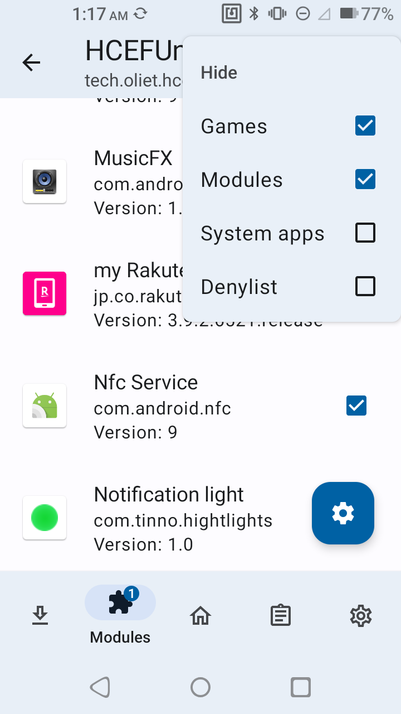

# HCEFUnlocker

An Xposed Module that Unlocks HCE-F (Host Card Emulation Type F) IDm and System code restrictions.

# NOTICE

This is an Xposed module, so that you should register this app to Xposed compatible framework.

If you are using LSPosed, need to unhide `System apps` and select `Nfc Service`. (<v2.4)

# LICENSE

This software includes the work that is distributed under the Apache License 2.0.
And it has some changes.
